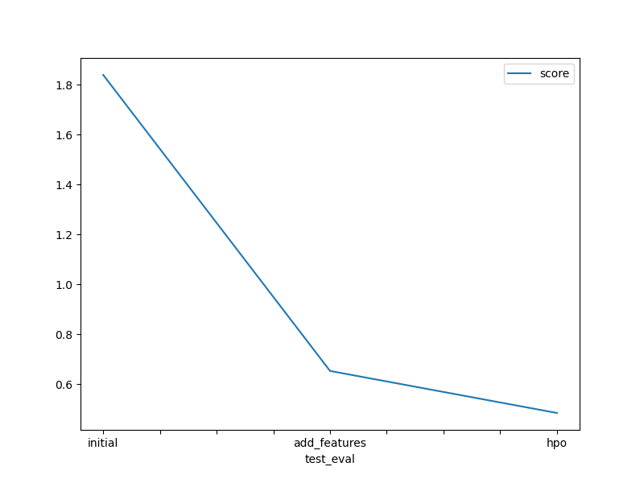

# Report: Predict Bike Sharing Demand with AutoGluon Solution
#### Ezekiel Ekanem

## Initial Training
### What did you realize when you tried to submit your predictions? What changes were needed to the output of the predictor to submit your results?
The minimum value of my predictions was 2.13. Hence, there were no negative values in my predictions. As a result, my predictions were submitted without any problem. 

### What was the top ranked model that performed?
The top ranked model that performed was "WeightedEnsemble_L3" with a score value of -52.73

## Exploratory data analysis and feature creation
### What did the exploratory analysis find and how did you add additional features?
When I viewed a histogram of the train dataset, I realised that the temperature, average temperature, and humidity was distributed normally. However, windspeed and count were skewed to the left. I added additional features by separating datetime into hours. I did this by creating a new "hour" column in my train and test datasets, converting all datetime column into hour and setting it to this new column. I also made category types for the "season" and "weather" columns in the test and train datasets, so that AutoGluon will classify them as categories and not ints.  

### How much better did your model preform after adding additional features and why do you think that is?
My data performed much better after adding additional features. My kaggle score went from 1.84007 to 0.65378. This is an improvement of 64.47%. I think my model performed better because simplifying the datetime to hour made the model to not only detect patterns in seasons but also detect patterns based on the hour of the day. This pattern was clouded when the model just had the datetime column. The hour column made this patterns more detectable. Also, the datetime column contained some noise which wasn't useful for training the model (e.g., the year shown has already been taken cared of by the 4 seasons in the "season" column). This noise can impede training and make the model focus on unimportant features. Moreover, the "hour" column normalizes the datetime column and made it easier for the model to learn generalized patterns in the dataset. 

Setting the dtype of "season" and "weather" column to categories also made the model to treat them as categories and not integers. This also helped the model to perform better. 

## Hyper parameter tuning
### How much better did your model preform after trying different hyper parameters?
After trying different hyper parameters, my model performed much better. My kaggle score decreased from 0.65378 to 0.48537. 

### If you were given more time with this dataset, where do you think you would spend more time?
If I was given more time with the dataset, I would spend more time tuning my hyperparameters in order to get a better prediction.

### Create a table with the models you ran, the hyperparameters modified, and the kaggle score.
|model|hpo1|hpo2|hpo3|hpo4|hpo5|hpo6|hpo7|hpo8|hpo9|score|
|--|--|--|--|--|--|--|--|--|--|--|
|initial|time_limit=600|presets=best_quality|-|-|-|-|-|-|-|1.84007|
|add_features|time_limit=600|presets=best_quality|-|-|-|-|-|-|-|0.65378|
|hpo|time_limit=720|presets=best_quality|RF: n_estimators: 50|RF: max_depth: 10|GBM: num_boost_round: 100|GBM: learning_rate: 0.1|num_trials: 20|scheduler: local|searcher: bayesopt|0.48537|

### Create a line plot showing the top model score for the three (or more) training runs during the project.

TODO: Replace the image below with your own.

### Create a line plot showing the top kaggle score for the three (or more) prediction submissions during the project.

TODO: Replace the image below with your own.

## Summary
The top model for my initial model training (WeightedEnsemble_L3) had a score value of -52.73. When I added additional features, such as setting the "seasons" and "weather" columns to category dtypes, and adding "hour" column to the datasets, WeightedEnsemble_L3 had an improved score value of -33.59. I then tuned the hyperparameters (setting the number of trees in the random forest ensemble to 50 and limiting the maximum depth of each tree to 10 as well as setting the number of decision trees in the Gradient Boosting Machine to 100 and the learning rate ensemble to 0.1) and the hyperparameter_tune_kwargs (setting the number of hyperparameters optimization trials to 20, used bayesian optimization to search strategy for hyperparameter tuning, and scheduled the tuning to be performed locally). RandomForest_BAG_L2 became my top model with a score value of -44.27. This might seem worse than the WeightedEnsemble_L3 for "add_features" model. However, RandomForest_BAG_L2 had a lower pred_time value and fit time than WeightedEnsemble_L3. 

Tuning the hyperparameter and adding extra features to my model was very useful and improved my model performance immensely. Now, I visually understand why exploratory data analysis and hyperparameter tuning are very important in Machine Learning. 
